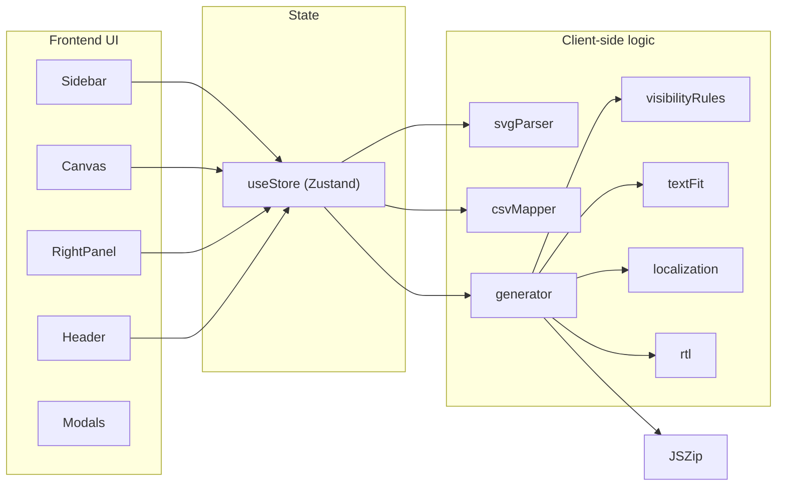

# Batchforge

Batchforge is a browser-based tool for generating many SVG variants from one design template and a CSV dataset. Upload an SVG with named layers, upload a CSV with one row per variant, map layers to columns, preview results, and download a ZIP of finished SVGs.

There is **no backend server**. Parsing, mapping, generation, and export all run in the browser.

---

## What it does

1. **Load a design** — an SVG file with named text and color layers.
2. **Load data** — a CSV where each row describes one output variant.
3. **Map layers to columns** — auto-matched by normalized names, with manual overrides in the UI.
4. **Configure rules** — optional visibility rules and filename patterns.
5. **Preview** — generate the first 50 SVGs and inspect them in-app.
6. **Export** — generate every row and download a ZIP.

Typical use case: badges, certificates, labels, or any repeatable graphic where text, colors, or layer visibility change per row.

---

## Architecture overview



| Layer | Role |
|-------|------|
| **UI** | React components for upload, layer tree, canvas preview, mapping panel, modals |
| **State** | Zustand store (`src/store/useStore.js`) holds SVG, CSV, mapping, rules, and generation progress |
| **Logic** | Pure JS modules in `src/lib/` handle parsing, mapping, and batch generation |
| **Export** | JSZip builds a downloadable archive in the browser |

---

## Frontend

**Stack:** React 19, Vite, Zustand, Tailwind CSS, DaisyUI, Motion

### Layout (`src/App.jsx`)

| Area | Component | Purpose |
|------|-----------|---------|
| Left | `Sidebar` | Upload design + CSV, layer tree, filters |
| Center | `Header`, `Canvas`, `StatusBar` | Filename format, preview/download actions, live SVG preview |
| Right | `RightPanel` | Mapping, manual overrides, visibility rules for selected layer |
| Overlays | `MappingReviewModal`, `CsvPreviewModal`, `ResultsModal`, `Toasts` | Review auto-mappings, inspect CSV, browse generated previews |

### Main UI flow

1. User uploads an SVG → `loadSvg()` parses layers and builds the layer tree.
2. User uploads a CSV → `loadCsv()` parses rows and auto-maps headers to layers.
3. If matches are found, `MappingReviewModal` opens so the user can confirm mappings.
4. User selects layers in the sidebar or canvas → `RightPanel` shows mapping and visibility controls.
5. User clicks **Preview** → first 50 SVGs are generated; `ResultsModal` shows thumbnails.
6. User clicks **Download ZIP** → all rows are generated and exported.

### Canvas

`Canvas.jsx` renders the current SVG in the browser and highlights selected layers. During generation it can show a live preview of the SVG being built. Mapping overlays can be toggled to show which layers are connected to CSV columns.

---

## Backend

Batchforge does **not** have a separate backend. There are no API routes, database, or server-side rendering.

All processing uses browser APIs:

- `DOMParser` / `XMLSerializer` for SVG read/write
- `File` + PapaParse for CSV parsing
- JSZip for ZIP creation
- `URL.createObjectURL` for triggering downloads

This keeps the tool simple to run locally and means uploaded files never leave the machine unless the user exports them.

---

## Core logic (`src/lib/`)

### `svgParser.js`

Parses an SVG string and extracts editable layers while preserving the group hierarchy for the layer panel.

- Layer names come from `data-name`, `inkscape:label`, or element `id` (in that order).
- Supported editable types: text (`<text>`, `<tspan>`) and color (elements with `fill` or `stroke`).
- Returns `docString` (normalized SVG), flat `layers[]`, and nested `layerTree[]`.

### `csvMapper.js`

- Uses PapaParse to read CSV files with headers.
- `autoMap()` matches layer names to column headers after normalization (case, underscores, trailing numbers stripped).

Example: layer `Button_2` and column `button` both normalize to `button` and auto-map.

### `generator.js`

The batch engine. For each CSV row:

1. Parse a fresh copy of the template SVG.
2. Apply **visibility rules** (UI-configured or CSV columns like `layer_name__visible`).
3. Apply **mirroring** when row data requests it.
4. For each mapped layer:
   - **Text** — insert value, fit to bounds, apply RTL if needed.
   - **Color** — set `fill` or `stroke`.
5. Serialize to SVG string and assign a filename from the format template.
6. Yield periodically so the UI stays responsive on large batches.

`downloadZip()` packages results into `batch.zip` and triggers a browser download.

### Supporting modules

| Module | Purpose |
|--------|---------|
| `normalize.js` | Name normalization for auto-mapping |
| `visibilityRules.js` | Conditional show/hide based on CSV values |
| `textFit.js` | Shrink/wrap text to fit layer bounds |
| `localization.js` | Format dates, numbers, currency via column suffixes (`__date`, `__number`, `__currency_USD`) |
| `rtl.js` | Right-to-left text when row locale requires it |
| `validation.js` | Color and input validation |
| `colors.js` | Color parsing helpers |

---

## State model (`useStore.js`)

Key state slices:

```text
svgText, docString, layers, layerTree     — loaded design
csvHeaders, csvRows                       — loaded data
mapping                                   — { rawId → { source, column?, value? } }
visibilityRules                           — per-layer conditional visibility
filenameFormat                            — e.g. {{name}}-{{row}}.svg
generation                                — progress, live preview, warnings
previewResults                            — first batch of generated SVGs
```

Mapping sources:

- `csv` — value comes from a CSV column
- `manual` — fixed value set in the UI
- `none` — layer is ignored for generation

---

## How generation works (step by step)

```text
CSV row
  ↓
Clone template SVG (DOMParser)
  ↓
Evaluate visibility rules → show/hide layers
  ↓
For each mapped layer:
  - resolve value (CSV / manual / localized)
  - update text or color in the DOM
  ↓
Serialize SVG → add to results[]
  ↓
Preview: first 50  |  Export: all rows → ZIP
```

Filename format supports `{{columnName}}` placeholders and `{{row}}` for the 1-based row index. Duplicate names get a numeric suffix.

---

## Running locally

```bash
cd MP2/batchforge
npm install
npm run dev
```

Open the URL Vite prints (usually `http://localhost:5173`).

Build for production:

```bash
npm run build
npm run preview
```

---

## Project structure

```text
MP2/batchforge/
├── src/
│   ├── App.jsx                 # Root layout
│   ├── main.jsx
│   ├── index.css
│   ├── store/useStore.js       # App state + actions
│   ├── components/             # UI (Sidebar, Canvas, modals, etc.)
│   └── lib/                    # Parsing, mapping, generation
├── public/
├── index.html
├── vite.config.js
└── package.json
```

---

## Design file expectations

**SVG layers** should be named in Figma (via `data-name`), Inkscape (`inkscape:label`), or plain SVG `id` attributes. Text and color layers are the primary editable targets.

**CSV** should have one header row and one data row per desired output. Column names that match layer names (after normalization) auto-map. Optional columns:

- `locale` — controls formatting and RTL
- `{layer}__visible` — per-row visibility override
- `{column}__date`, `__number`, `__currency_XXX` — formatted output

---

## Dependencies

| Package | Use |
|---------|-----|
| `react` / `react-dom` | UI |
| `zustand` | State management |
| `papaparse` | CSV parsing |
| `jszip` | ZIP export |
| `motion` | UI animations |
| `tailwindcss` / `daisyui` | Styling |
